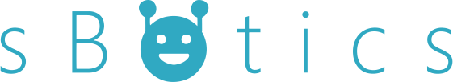
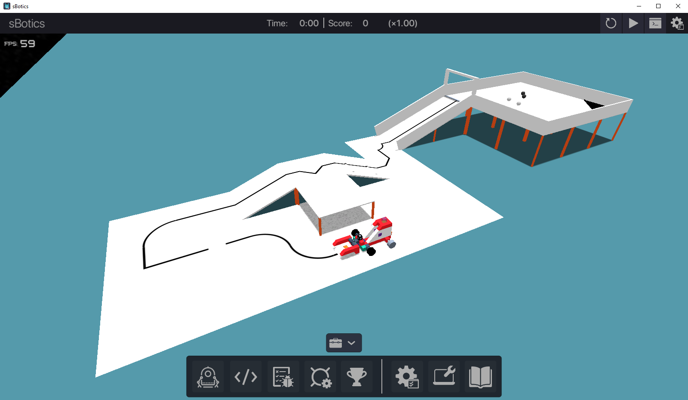

 

	
     
    An acessible Robotics Kit, from the comfort of your chair.

 

<h2 align="center">
	sBotics Releases
</h2>

    <b>For non-commercial (educational) purposes <i>only</i></b>.
	 
    <b><i>Apenas</i> para usos não-comerciais (educacionais)</b>.
      
    
        <a href="#portuguese"> Português</a> 
        &nbsp;•&nbsp;
        <a href="#english"> English</a>
    
	 
	<strong>
		<a href="https://sbotics.net">Website</a>
		•
		<a href="https://docs.sbotics.net">Documentation</a>
	</strong>

 

	

 

--------------
<h2 id="english">  &nbsp;English </h2> 

This repository contains the files for the sBotics Unity Simulator. Please download it from our website: [sBotics.net](https://sbotics.net). We won't give support to those who downloaded directly from this repository.

--------------
<h2 id="portuguese">  &nbsp;Português (Brasileiro) </h2> 

Este repositório contém os arquivos para a aplicação Unity sBotics. Por favor baixe-a de nosso site: [sBotics.net](https://sbotics.net). Não daremos suporte àqueles que baixarem a aplicação diretamente deste repositório.

--------------

## License and terms
 As sBotics itself is a closed-source software, this repository may serve *only* for educational purposes. You can still fork and create pull-requests on documentation, however, all recreations must also be open source and for educational purposes, **never** for personal gains or profit.

 Visto que o sBotics em si é um software de código fechado, este repositório deve servir *apenas* para propósitos educacionais. Você pode criar forks e pull-requests relacionados a melhorias de documentação, entretanto toda e qualquer recriação deve também ser de código aberto e **jamais** para ganhos pessoais ou lucro.